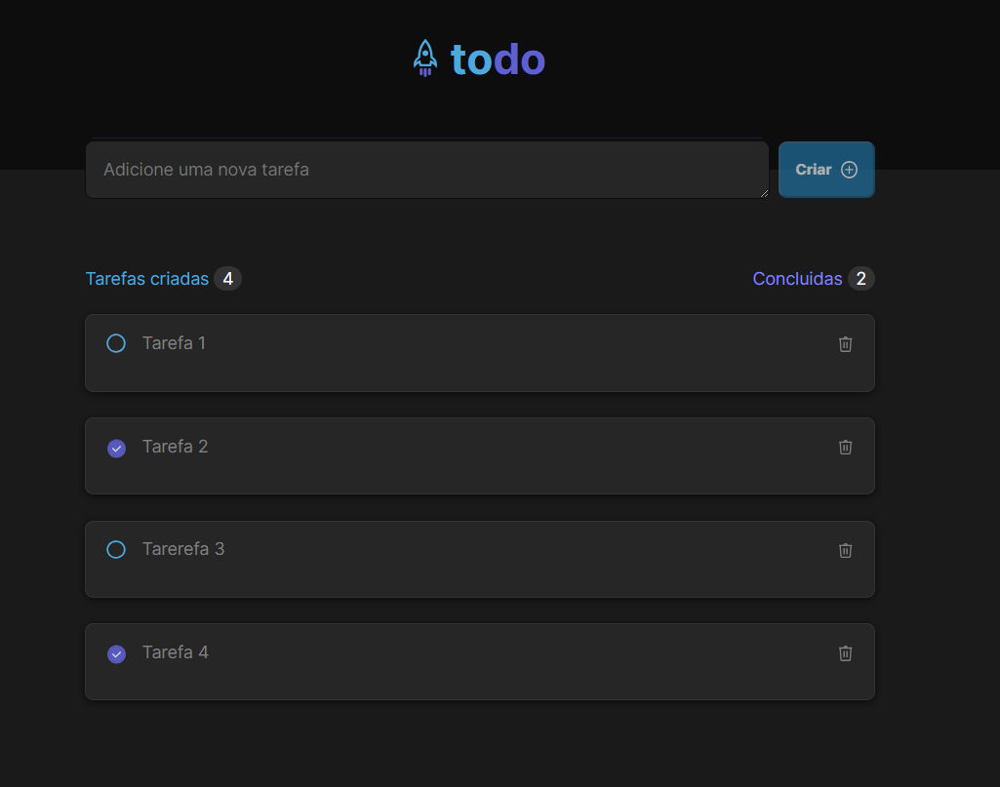

<h1 align="center"> TodoList </h1>

 

  
  ## 💻 Projeto
Desafio da trilha de ReactJS do Ignite Rocketseat  
A aplicação é um controle de tarefas no estilo lista de afazeres (to-do list) com as seguintes funcionalidades:

Adicionar uma nova tarefa 
Marcar ou desmarcar uma tarefa como concluída 
Remover uma tarefa da lista 
Exibir o progresso de conclusão das tarefas 

## 🚀 Tecnologias
Esse projeto foi desenvolvido com as seguintes tecnologias:
 HTML e CSS 
 TypeScript 
 ReactJs e Vite 
 Git e Github

## 🔖 Layout
Você pode visualizar o layout do projeto através [DESSE LINK](https://www.figma.com/file/K84P93Yrr0Evkam4Pk34NH/ToDo-List-%E2%80%A2-Desafio-React-Copy?fuid=988659321069341643). É necessário ter conta no [Figma](https://figma.com) para acessá-lo.

 